# CAPTSONE PROJECT AZURE MACHINE LEARNING ENGINEER

This is the capstone project for the Azure Machine Learning Engineer where we put it all together and combine Machine Learning through the Azure platform to deploy a model.

## Project Set Up and Installation
Firstly to run models and environments in Azure you need a login.  In this case the UDACITY VM access point is used with a predifined login and access to compute resources.

From the login the basic steps involved are

1. Upload or provide URL access to the dataset
2. Run the AutoML notebook, here the dataset is run through the AutoML config based on parameter setups as appointed in the Python SDK (notebook).  Once the experiment is complete, the children runs are compared for the best model.
3. Run the Hyperdrive notebook.  This includes udpating a train.py script to allow access to the dataset, either locally or through a URL and provide any preprocessing steps.  Hyperdrive allows the use of pytorch, tensorflow and Sckit learn packages which enables the use of typical Python learning algoritms.  The train script includes suitable preprocessing steps as required to pass to the model.  The model also includes several parameters that allow passing to the hyperdrive portion of the script run config.  This allows the Machine Learner to optimise a chosen model and ideally improve the results.
4. Compare the two experiments and deploy the best model.
5. Access the scoring UI to test the endpoint i.e. put new data through the model.

## Dataset

### Overview
The dataset explored for this project is the Adult dataset, which is a banking classification problem trying to identify whether or not an individal earns more than 50k.  It consists of 14 Variables and 1 target variable (wage-outcome).  The file location can be found as per the below weblink.

https://archive.ics.uci.edu/ml/datasets/Adult

The variables are shown below: 

Variable |Datatype|Description
-|-|-
age|Integer|Age
workclass|Object|	Working Class
fnlwgt|Numerical|Final Weight
education|Object|Education Level
education-num.|Integer|Number of years of education in total
marital-status|Object|Marital Status
occupation|Object|Occuptation, Employment
relationship|Object|Relationship
race|Object|Race
sex|Object|Gender
capital-gain|Numerical|Income (gain) from Investment Sources
capital-loss|Numerical|Income (loss) from Investment Sources
hours-per-week|Numerical	
native-country|Object|Country Born
wage-outcome|Object|Outcome, dependent variable

https://archive.ics.uci.edu/ml/datasets/Adult

### Task
The primary task with this model is classification where we are attempting to predict whether or not someone is likely to earn more or less than 50k.

### Access
To access the data, I downloaded the data and uploaded the csv into my github link.  I created two methods for accessing the data.
1. Load the CSV into the datastores, and provide access to it through
run = Run.get_context()

ws = run.experiment.workspace

dataset = Dataset.get_by_name(workspace, name='Adult')

ds = dataset.to_pandas_dataframe()

2. Alternatively access this through URL 
'url = 'https://raw.githubusercontent.com/boffyd/UdacityMLOPs-Capstone/main/adult.csv'
dataset = TabularDatasetFactory.from_delimited_files(url,header = False)

ds = dataset.to_pandas_dataframe()

For AutoML you don't pass pandas dataframes to the AutoML config, these need to remain as Tabular Datasets within the AzureML Environment.

## Automated ML
*TODO*: Give an overview of the `automl` settings and configuration you used for this experiment

AutoML is a vast tool that if left unchecked can consume a lot of resources.  Primarily as per previous assignments alot of the settings where used to spare compute resources including experiment timeout of 30 minutes.  The settings are shown below.  Possible changes could be to the primary metric, this was left to be consistent with the training script created for hyperdrive.  Another time saver that could of improved the output was the number of cross validations, where 3 was chosen.

    experiment_timeout_minutes = 30,

    primary_metric = 'accuracy'
    
    n_cross_validations = 3, #typically 5, used to make time go quicker.
    
    task = 'classification',
    
    training_data = tabular_dataset,
    
    debug_log = 'automl_errors.log',
    
    label_column_name = 'wage',
    
    enable_onnx_compatible_models = True

### Results
*TODO*: What are the results you got with your automated ML model? What were the parameters of the model? How could you have improved it?

The AutoML Project Was completed.

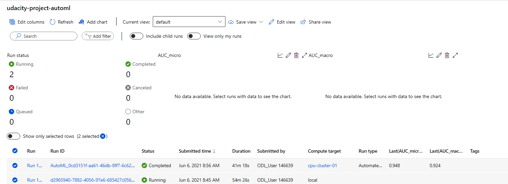

AUTOML COMPLETE

The best performing model was voting ensemble with an accuracy of 0.86997.  Defining the parameters used for this results in a combination of many models.  These can be seen below.

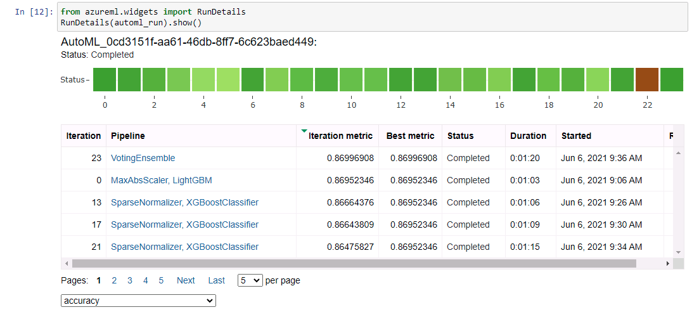

AUTOML WIDGET

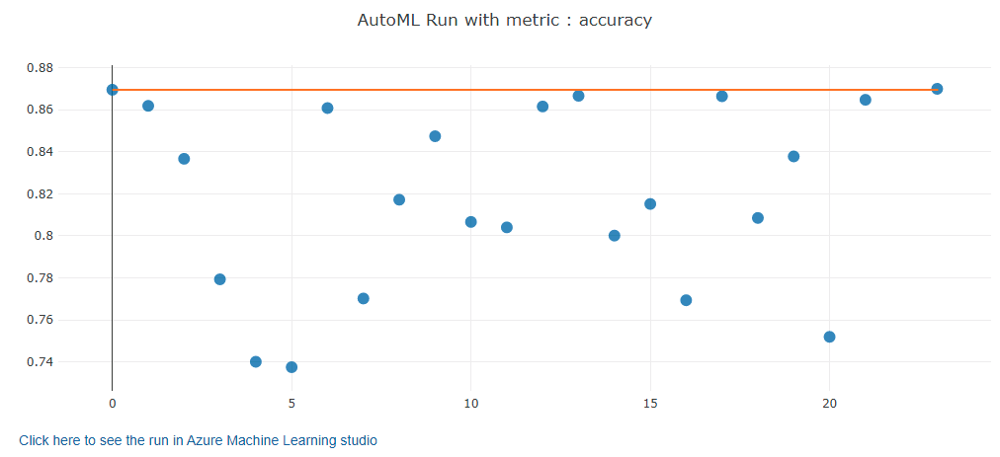

MODEL ACCURACY

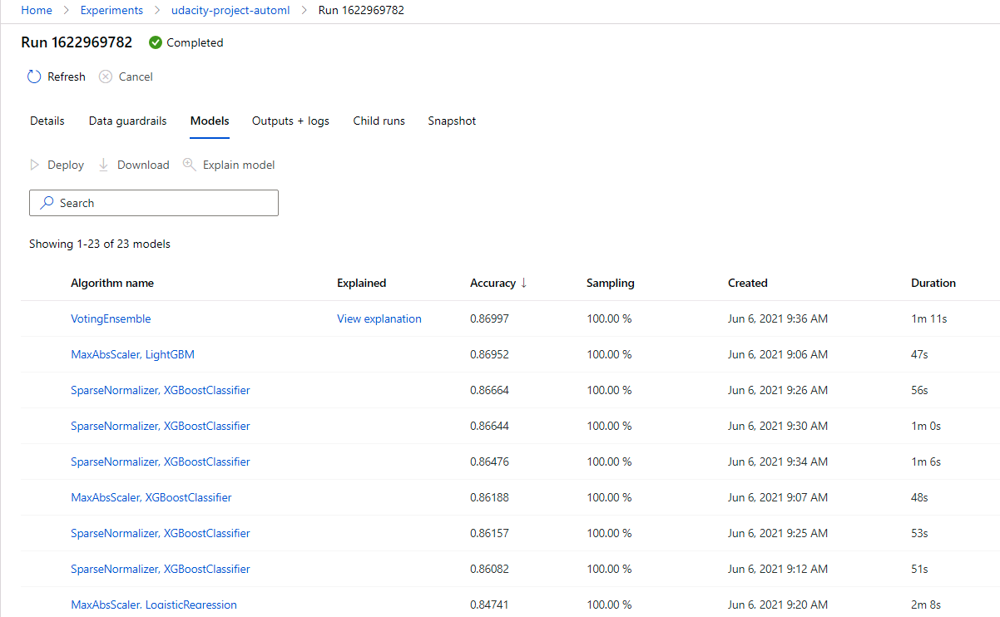

MODEL OUTCOME

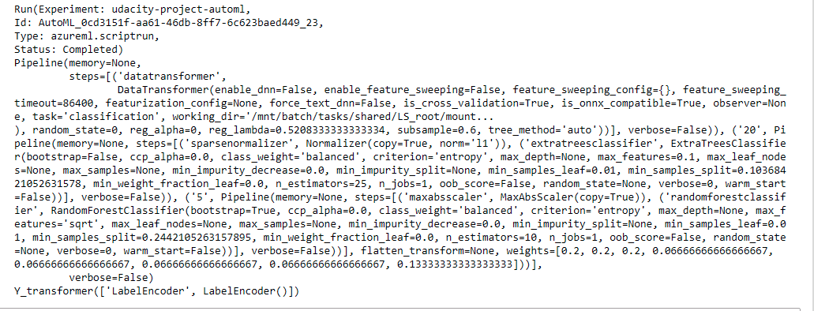

BEST MODEL PARAMETERS

*TODO* Remeber to provide screenshots of the `RunDetails` widget as well as a screenshot of the best model trained with it's parameters.

## Hyperparameter Tuning
*TODO*: What kind of model did you choose for this experiment and why? Give an overview of the types of parameters and their ranges used for the hyperparameter search

For this project I chose XGBoostClassifier because it is quite robust, its a gradient boosting ensemble classification algorithm.  There are a multitude of hyperparameters that can be used.

To limit the compute resources I have chose
Max Depth - This defines the number of trees that can selected for each estimater.  Larger numbers can lead more to overfitting, so for this experiment the field has been set relatively low.

Learning Rate - This is a weighting factor that can be applied to the boosting model.

Primary Metric is Accuracy.

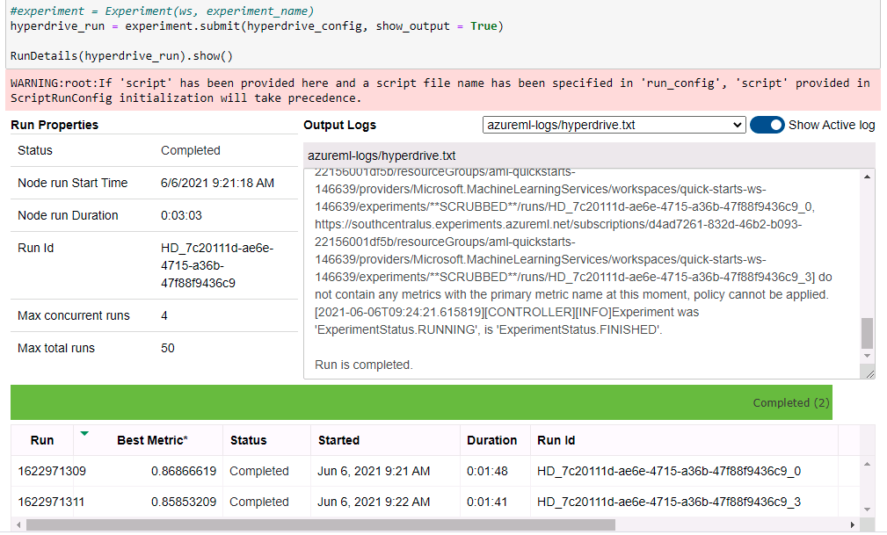

HYPERDRIVE WIDGET

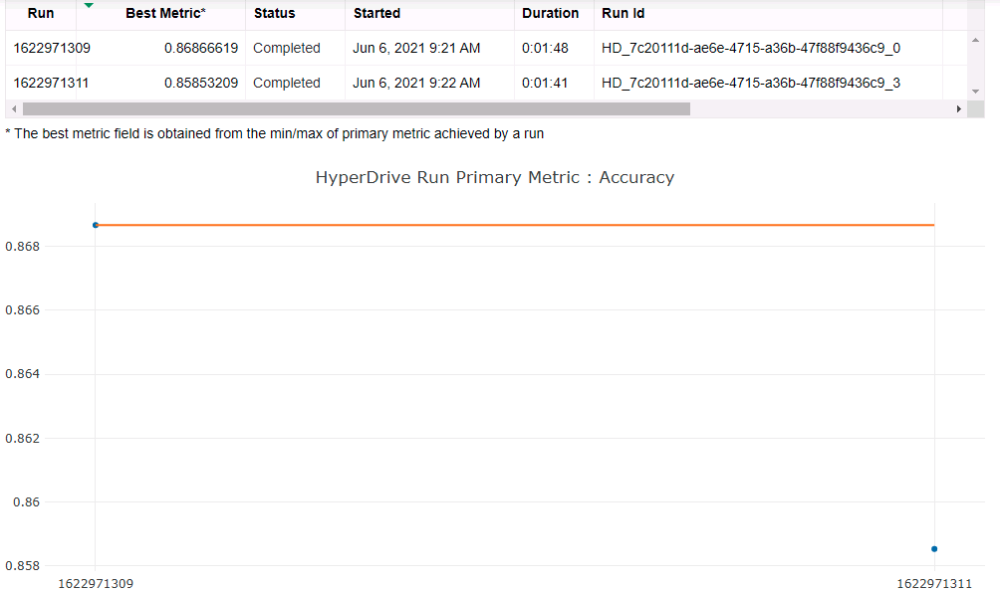

HYPERDRIVE WIDGET

### Results

The best run metrics where
Accuracy 0.869
Max Depth 2
Learning Rate 1

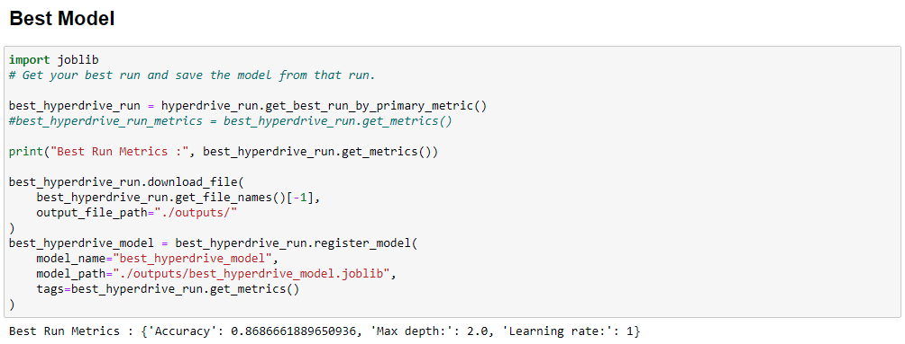
BEST MODEL PARAMETERS

The results where similar to the AutoML, better ways to improve this might be to go to a grid search, include more variables including the number of estimators.

For example, 

max depth could be changed to be 2, 5 and 10

learning rate, could be changed to 0.1, 0.5, 1, 2

add additional hyperparameters (which will consume more resources)

Other improvements would be additional pre-processing including
1. Change the the training script to provide a different encoding method,
2. More work on data leakage, feature engineering and dropping correlated variables

Changing the primary metric, AUC is also used for classification (for example).

*TODO* Remeber to provide screenshots of the `RunDetails` widget as well as a screenshot of the best model trained with it's parameters.

## Model Deployment
*TODO*: Give an overview of the deployed model and instructions on how to query the endpoint with a sample input.

The model was deployed through the Azure Machine Learning services.  The AutoML model was the best performing, with VotingEnsemble.  This was then selected for deployment.  Once deployed with Container Instances it then provides a Scoring URI that can be access including authentication keys.  From here the inputs were verified through swagger and several test units were passed to the active endpoint.  Refer to the below images.

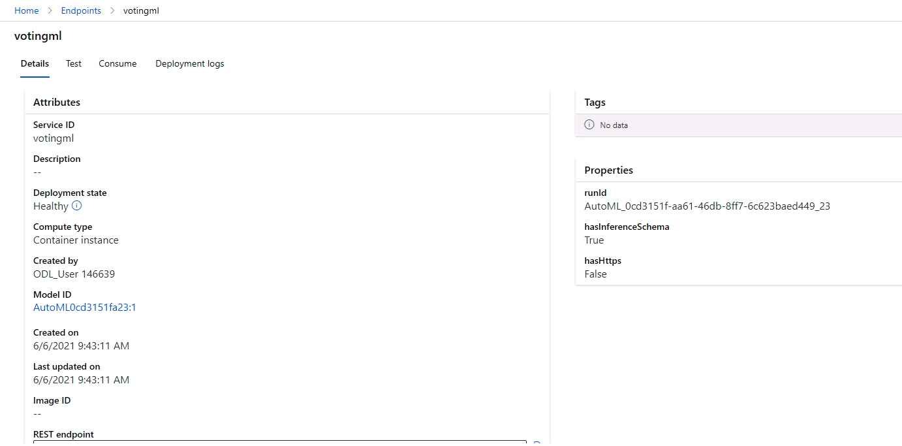

ENDPOINT ACTIVE

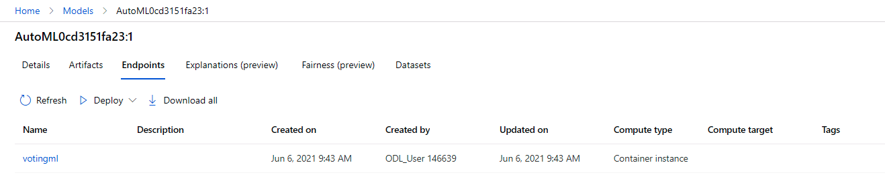

ENDPOINT ACTIVE

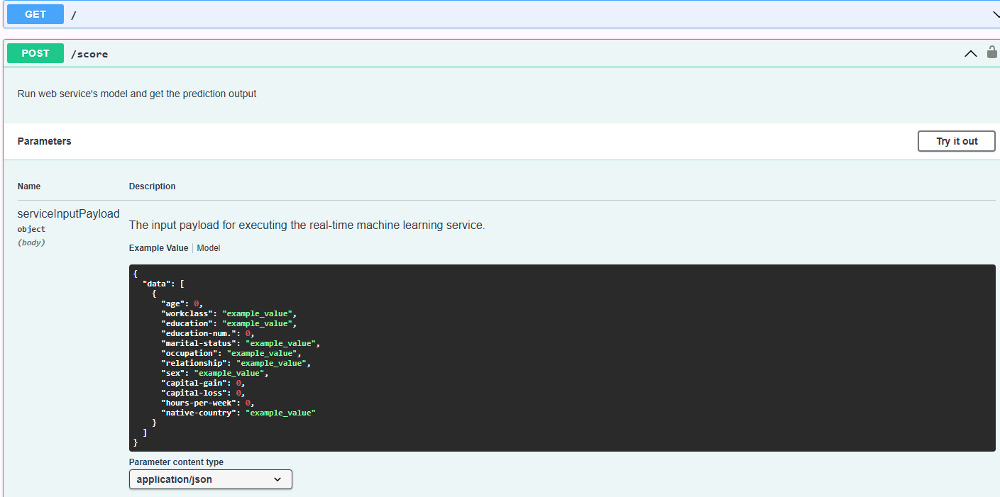

SWAGGER

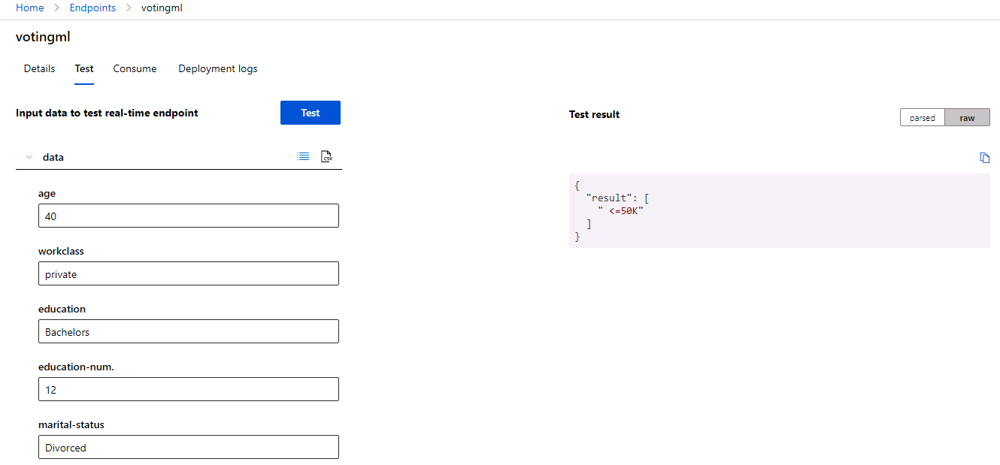

ENDPOINT TEST

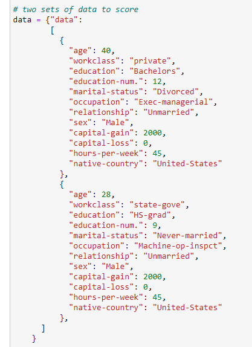

ENDPOINT TEST

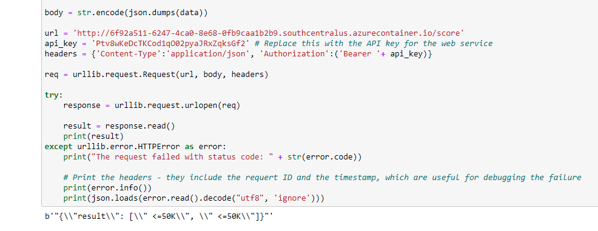

ENDPOINT TEST

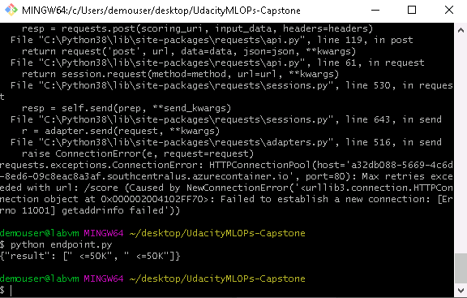

ENDPOINT TEST

## Screen Recording

https://youtu.be/_88sGzycrTU 

*TODO* Provide a link to a screen recording of the project in action. Remember that the screencast should demonstrate:
- A working model
- Demo of the deployed  model
- Demo of a sample request sent to the endpoint and its response

## Standout Suggestions
The automl was converted to ONNX fomrat.
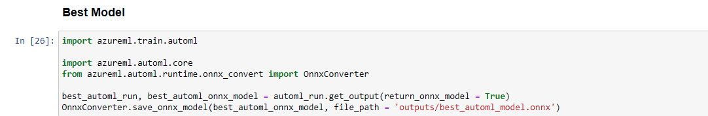

ONNX MODEL OUTPUT

